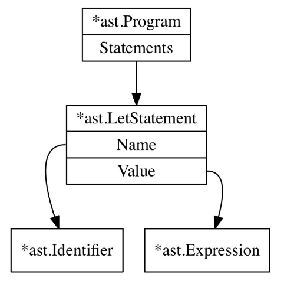

# 解析器第一步：解析let语句

在Monkey语言中，变量绑定语句形式如下：
```js
let x = 5;
let y = 10;
let foobar = add(5, 5);
let barfoo = 5 * 5 / 10 + 18 - add(5, 5) + multiply(124); 
let anotherName = barfoo;
```
这种语句称为“let语句”，它把变量值绑定到一个名字上。

正确工作的解析器将构造一个符合原始语句信息的抽象语法树。

定义抽象语法树节点：
```rust,noplaypen
// src/ast.rs

pub trait NodeTrait {
    fn token_literal(&self) -> String;
}

pub enum Node {
    Statement(Statement),
    Expression(Expression),
}

pub enum Statement {}
impl NodeTrait for Statement {
    fn token_literal(&self) -> String {
        String::new() //TODO
    }
}

pub enum Expression {}
impl NodeTrait for Expression {
    fn token_literal(&self) -> String {
        String::new() //TODO
    }
}
```
注意Rust语言的Trait与其它语言的接口不完全是同一个概念，在向下类型转换（downcast）时也不是很方便，这里就没有采用原著中的接口继承和强制类型转换方式来实现。

Rust语言具有强大的enum和match匹配能力，本文用enum来定义Node、Statement和Expression，以便用match语句进行类型匹配。

上述代码中的NodeTrait规定了所有Node的共同特征，具有token_literal方法，该方法返回当前Node节点的Token字面量（literal)。Monkey语言AST中节点Node可以是Statement，也可以是Expression。下面再加上一种：Program节点。

定义Program：
```rust,noplaypen
// src/ast.rs 

pub struct Program {
    pub statements: Vec<Statement>,
}
impl NodeTrait for Program {
    fn token_literal(&self) -> String {
        if self.statements.len() > 0 {
            self.statements[0].token_literal()
        } else {
            String::new()
        }
    }
}
```
在Node枚举中加入Program：
```rust,noplaypen
// src/ast.rs

pub enum Node {
    Program(Program),
    Statement(Statement),
    Expression(Expression),
}
```
Program节点是所有AST的根节点，包含一系列Statement节点。

下面定义let语句：
```rust,noplaypen
// src/ast.rs

use super::token::*;

pub struct LetStatement {
    pub token: Token,
    pub name: Identifier,
    pub value: Expression,
}
impl NodeTrait for LetStatement {
    fn token_literal(&self) -> String {
        self.token.literal.clone()
    }
}

pub struct Identifier {
    pub token: Token,
    pub value: String,
}
impl NodeTrait for Identifier {
    fn token_literal(&self) -> String {
        self.token.literal.clone()
    }
}
```
LetStatement节点包含name和value两个成员，其中name表示绑定的标识符，value表示产生值的表达式。Identifier节点包含的value即标识符的名字。

将LetStatement加入Statement，将Identifier加入Expression，如下：
```rust,noplaypen
// src/ast.rs

pub enum Statement {
    LetStatement(LetStatement),
}
impl NodeTrait for Statement {
    fn token_literal(&self) -> String {
        match self {
            Statement::LetStatement(let_stmt) => let_stmt.token_literal(),
        }
    }
}
pub enum Expression {
    Identifier(Identifier),
}
impl NodeTrait for Expression {
    fn token_literal(&self) -> String {
        match self {
            Expression::Identifier(ident) => ident.token_literal(),
        }
    }
}
```
定义完上述三种节点，则Monkey源代码：
```js
let x = 5;
```
将形成以下AST：




下面我们开始编码解析器：
```rust,noplaypen
// src/parser.rs

use super::ast::*;
use super::lexer::*;
use super::token::*;

pub struct Parser<'a> {
    pub l: Lexer<'a>,
    pub cur_token: Token,
    pub peek_token: Token,
}
impl<'a> Parser<'a> {
    pub fn new(l: Lexer<'a>) -> Parser<'a> {
        let mut p = Parser {
            l: l,
            cur_token: new_token(TokenType::ILLEGAL, 0),
            peek_token: new_token(TokenType::ILLEGAL, 0),
        };
        p.next_token();
        p.next_token();
        p
    }

    pub fn next_token(&mut self) {
        self.cur_token = self.peek_token.clone();
        self.peek_token = self.l.next_token();
    }

    pub fn parse_program(&mut self) -> Option<Program> {
        None
    }
}
```
解析器有三个成员：词法分析器，当前Token，下一个Token。next_token()方法的功能就是从词法分析器中读取Token并更新当前Token和下一个Token。

在创建解析器时调用了两次next_token方法，是为了初始化当前Token和下一个Token。不用担心input是否够用的问题，词法分析器在input结尾处会一直返回EOF。

由于这里需要调用Token的clone方法，修改Token和TokenType的属性如下：
```rust,noplaypen
// src/token.rs

#[derive(Debug, Clone)]
pub struct Token {
    pub tk_type: TokenType,
    pub literal: String,
}

#[derive(PartialEq, Debug, Clone)]
pub enum TokenType {   
// [...] 
```
在继续进一步工作前，先用伪代码解释一下解析器的工作原理：
```js
function parseProgram() { 
    program = newProgramASTNode()

    advanceTokens()

    for (currentToken() != EOF_TOKEN) {
        statement = null

        if (currentToken() == LET_TOKEN) { 
            statement = parseLetStatement()
        } else if (currentToken() == RETURN_TOKEN) { 
            statement = parseReturnStatement()
        } else if (currentToken() == IF_TOKEN) { 
            statement = parseIfStatement()
        }

        if (statement != null) { 
            program.Statements.push(statement)
        }
    
        advanceTokens() 
    }
    return program 
}

function parseLetStatement() { 
    advanceTokens()

    identifier = parseIdentifier()

    advanceTokens()

    if currentToken() != EQUAL_TOKEN { 
        parseError("no equal sign!") 
        return null
    }

    advanceTokens()

    value = parseExpression()
    variableStatement = newVariableStatementASTNode() 
    variableStatement.identifier = identifier 
    variableStatement.value = value
    return variableStatement
}

function parseIdentifier() { 
    identifier = newIdentifierASTNode() 
    identifier.token = currentToken() 
    return identifier
}

function parseExpression() {
    if (currentToken() == INTEGER_TOKEN) {
        if (nextToken() == PLUS_TOKEN) {    
            return parseOperatorExpression()
        } else if (nextToken() == SEMICOLON_TOKEN) { 
            return parseIntegerLiteral()
        }
    } else if (currentToken() == LEFT_PAREN) {
        return parseGroupedExpression() 
    }
// [...]
}

function parseOperatorExpression() {
    operatorExpression = newOperatorExpression()
    operatorExpression.left = parseIntegerLiteral() 
    operatorExpression.operator = currentToken() 
    operatorExpression.right = parseExpression()
    return operatorExpression() 
}
// [...]
```
上述伪代码的基本思想是递归下降解析。入口是parseProgram，用来构造AST的根节点，然后调用它的子节点解析函数，构造各个Statement。这些解析函数再调用它们的解析函数，递归下去，解析完成时返回的是整个AST。

下面我们继续开发，先写测试用例：
```rust,noplaypen
// src/parser_test.rs

use super::ast::*;
use super::lexer::*;
use super::parser::*;

#[test]
fn test_let_statements() {
    let input = "
let x = 5;
let y = 10;
let foobar = 838383;
";
    let l = Lexer::new(input);
    let mut p = Parser::new(l);
    let program = p.parse_program();
    if let Some(Program { statements }) = program {
        assert!(
            statements.len() == 3,
            "program.statements does not contain 3 statements. got={}",
            statements.len()
        );

        let tests = ["x", "y", "foobar"];
        for (i, tt) in tests.iter().enumerate() {
            test_let_statement(&statements[i], tt);
        }
    } else {
        assert!(false, "parse_program() returned None");
    }
}

fn test_let_statement(s: &Statement, expected_name: &str) {
    assert!(
        s.token_literal() == "let",
        "s.token_literal not 'let'. got={}",
        s.token_literal()
    );

    if let Statement::LetStatement(LetStatement {
        token: _,
        name,
        value: _,
    }) = s {
        assert!(
            name.value == expected_name,
            "letStmt.name.value not '{}', got={}",
            expected_name,
            name.value
        );

        assert!(
            name.token_literal() == expected_name,
            "s.name not '{}'. got={}",
            expected_name,
            name.token_literal()
        );
    } else {
        assert!(false, "s not LetStatement. got={:?}", s);
    }
}
```
测试用例的思想是递归下降验证解析出来的AST，跟预期的AST是否一致。

上述代码还使用了Rust语言中的if let语句，这种语句可以匹配展开复杂的数据结构，酷！

测试中需要打印输出Statement，因此需要添加Statement的Debug属性，进而需要添加Expression, LetStatement和Identifier的Debug属性：
```rust,noplaypen
// src/ast.rs

#[derive(Debug)]
pub enum Statement {
    LetStatement(LetStatement),
}

#[derive(Debug)]
pub enum Expression {
    Identifier(Identifier),
}

#[derive(Debug)]
pub struct LetStatement {
    pub token: Token,
    pub name: Identifier,
    pub value: Expression,
}

#[derive(Debug)]
pub struct Identifier {
    pub token: Token,
    pub value: String,
}
```
为了支持测试，需要修改lib.rs，加入下面几行。
```rust,noplaypen
// src/lib.rs

pub mod ast;
pub mod parser;

mod parser_test;
```
测试失败的信息如下：
```
thread 'parser::tests::test_let_statements' panicked at 'parse_program() returned None', src/parser_test.rs:59:13
```
必然的，因为parse_program还没实现呢。

实现如下：
```rust,noplaypen
// src/parser.rs

    pub fn parse_program(&mut self) -> Option<Program> {
        let mut statements: Vec<Statement> = Vec::new();

        while self.cur_token.tk_type != TokenType::EOF {
            if let Some(stmt) = self.parse_statement() {
                statements.push(stmt);
            }
            self.next_token();
        }

        Some(Program {
            statements: statements,
        })
    }

    fn parse_statement(&mut self) -> Option<Statement> {
        match self.cur_token.tk_type {
            TokenType::LET => {
                if let Some(stmt) = self.parse_let_statement() {
                    return Some(Statement::LetStatement(stmt));
                }
                None
            }
            _ => None,
        }
    }

    fn parse_let_statement(&mut self) -> Option<LetStatement> {
        let token = self.cur_token.clone();
        if !self.expect_peek(TokenType::IDENT) {
            return None;
        }

        let name = Identifier {
            token: self.cur_token.clone(),
            value: self.cur_token.literal.clone(),
        };

        if !self.expect_peek(TokenType::ASSIGN) {
            return None;
        }

        // TODO: 我们将跳过分号之前的表达式
        while !self.cur_token_is(TokenType::SEMICOLON) {
            if self.cur_token_is(TokenType::EOF) {
                return None;
            }
            self.next_token();
        }

        Some(LetStatement {
            token: token,
            name: name,
            value: Expression::MockExpression { v: 0 },
        })
    }

    fn cur_token_is(&self, t: TokenType) -> bool {
        self.cur_token.tk_type == t
    }
    fn peek_token_is(&self, t: TokenType) -> bool {
        self.peek_token.tk_type == t
    }
    fn expect_peek(&mut self, t: TokenType) -> bool {
        if self.peek_token_is(t) {
            self.next_token();
            true
        } else {
            false
        }
    }
```
由于LetStatement的value是Expression，目前为止，我们还没有能解析Expression的能力，只能跳过，我这里做了一个占位用的MockExpression定义，未来需要移除，代码如下：
```rust,noplaypen
// src/ast.rs

#[derive(Debug)]
pub enum Expression {
    Identifier(Identifier),
    MockExpression { v: i32 }, //TODO remove
}
impl NodeTrait for Expression {
    fn token_literal(&self) -> String {
        match self {
            Expression::Identifier(ident) => ident.token_literal(),
            Expression::MockExpression { v: _ } => String::new(), //TODO remove
        }
    }
}
```
测试通过！

大家可以比较一下用Rust实现的program、statement和let_statement的解析过程，跟伪代码逻辑是一致的，只是暂时缺少解析其它类型语句的分支，我们会在后续的开发过程中补上。

为了更好地调试，我们在继续工作之前先为解析器加入一些错误处理的能力：
```rust,noplaypen
// src/parser.rs

pub struct Parser<'a> {
    pub l: Lexer<'a>,
    pub cur_token: Token,
    pub peek_token: Token,
    pub errors: Vec<String>,
}

impl<'a> Parser<'a> {
    pub fn new(l: Lexer<'a>) -> Parser<'a> {
        let mut p = Parser {
            l: l,
            cur_token: new_token(TokenType::ILLEGAL, 0),
            peek_token: new_token(TokenType::ILLEGAL, 0),
            errors: Vec::new(),
        };
// [...]
    }

    fn peek_error(&mut self, t: TokenType) {
        let msg = format!(
            "expected next token to be {:?}, got {:?} instead",
            t, self.peek_token.tk_type
        );
        self.errors.push(msg);
    }
}
```
这样，测试用例就可以改为：
```rust,noplaypen
// src/parser_test.rs

fn test_let_statements() {
// [...]
    let program = p.parse_program();
    check_parser_errors(&mut p);

// [...]
}

fn check_parser_errors(p: &mut Parser) {
    if p.errors.len() == 0 {
        return;
    }

    let mut msgs = String::from(format!("parser has {} errors\n", p.errors.len()));
    for msg in p.errors.iter() {
        msgs.push_str(&format!("parser error: {:?}\n", msg));
    }
    assert!(false, msgs);
}
```
修改expect_peek，加上收集错误的代码调用：
```rust,noplaypen
// src/parser.rs

    fn expect_peek(&mut self, t: TokenType) -> bool {
        if self.peek_token_is(t.clone()) {
            self.next_token();
            true
        } else {
            self.peek_error(t);
            false
        }
    }
```
注意，这里执行了一次t.clone()，因为根据Rust的安全限制，不能访问已经移走的对象，因此第一次访问t时候我使用的是复制出来的对象。

为了测试一下解析错误的情况，可以临时修改测试用例：
```rust,noplaypen
// src/parser.rs

    fn test_let_statements() {
        let input = "
let x 5;
let = 10;
let 838383;
";
```
测试得到的结果如下：
```
thread 'parser::tests::test_let_statements' panicked at 'parser has 3 errors
parser error: "expected next token to be ASSIGN, got INT instead"
parser error: "expected next token to be IDENT, got ASSIGN instead"
parser error: "expected next token to be IDENT, got INT instead"
```
我们刚刚加的错误处理起效了。

