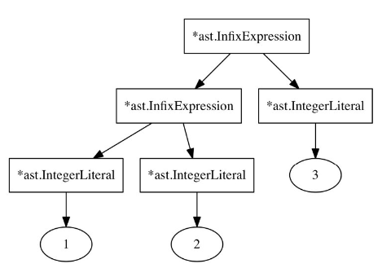

# 普拉特解析是如何工作的？

假设我们的表达式语句：
```js
1 + 2 + 3;
```
我们期望的AST对应的表达应该是这样的：
```js
((1 + 2) + 3)
```
图形表示如下：


当我们解析表达式的时候是这样的，parse_expression_statement调用parse_expression(Precedence::LOWEST)，cur_token和peek_token分别是1和第一个“+”：


接下来parse_expression根据cur_token（整数）决定调用parse_integer_literal解析方法，并将返回值赋值给left_exp。

然后判断循环条件：
```rust,noplaypen
        while !self.peek_token_is(&TokenType::SEMICOLON) && precedence < self.peek_precedence() {
// [...]
        }
```

peek_token（“+”号）的优先级比当前方法参数precedence的优先级（LOWEST）高，条件为真，执行循环体，即按中缀表达式解析。执行之前先通过调用next_token方法向前更新Token，如下图：


位于这个状态后，调用parse_infix_expression，传入的参数left是1。
```rust,noplaypen
// src/parser/parser.rs

    fn parse_infix_expression(&mut self, left: Expression) -> Result<Expression, String> {
        let token = self.cur_token.clone();
        let operator = self.cur_token.literal.clone();
        let precedence = self.cur_precedence();
        self.next_token();
        let right = self.parse_expression(precedence)?;
        Ok(Expression::InfixExpression(InfixExpression {
            token: token,
            left: Box::new(left),
            operator: operator,
            right: Box::new(right),
        }))
    }
```
这里先保存cur_token（“+”）的优先级，然后向前更新Token，状态如下：


第二次调用parse_expression，传入之前保存的（“+”）优先级，这次会再次调用parse_integer_literal解析表达式2，然后重复上面的优先级比较，由于这次取到的（“+”）优先级与参数传入的优先级一致，不能进入中缀表达式处理循环，表达式2会直接返回。

调用回到了parse_infix_expression，返回的表达式2和参数传入的表达式1一起构成了中缀表达式节点，如下：


返回parse_express，然后再次判断循环条件，precedence仍然是LOWEST，循环体再次执行，将刚刚构造的中缀表达式节点作为left，调用parse_infix_expression，循环体再次结束时构造的AST节点已经是这个样子了：



这时Token状态如下：


再次判断循环条件，遇到了分号，循环终止，parse_expreesion完成，返回AST节点。

分析上述代码可以看出，优先级高的Token会在AST中层次更深。

再考察一个例子：
```js
-1 + 2;
```

调用parse_expression，根据“-”调用parse_prefix_expression，代码如下：
```rust,noplaypen
// src/parser/parser.rs

    fn parse_prefix_expression(&mut self) -> Result<Expression, String> {
        let token = self.cur_token.clone();
        let operator = self.cur_token.literal.clone();
        self.next_token();
        let right = self.parse_expression(Precedence::PREFIX)?;

        Ok(Expression::PrefixExpression(PrefixExpression {
            token: token,
            operator: operator,
            right: Box::new(right),
        }))
    }
```
再次调用parse_expression时，参数为Precedence::PREFIX，这个优先级高于后面的“+”优先级，因此只会把现在解析出来的1跟“-”结合，而不会进入中缀表达式处理循环。

上述只是简单描述了一下普拉特解析方法，具体描述请参阅相关论文和原著。


